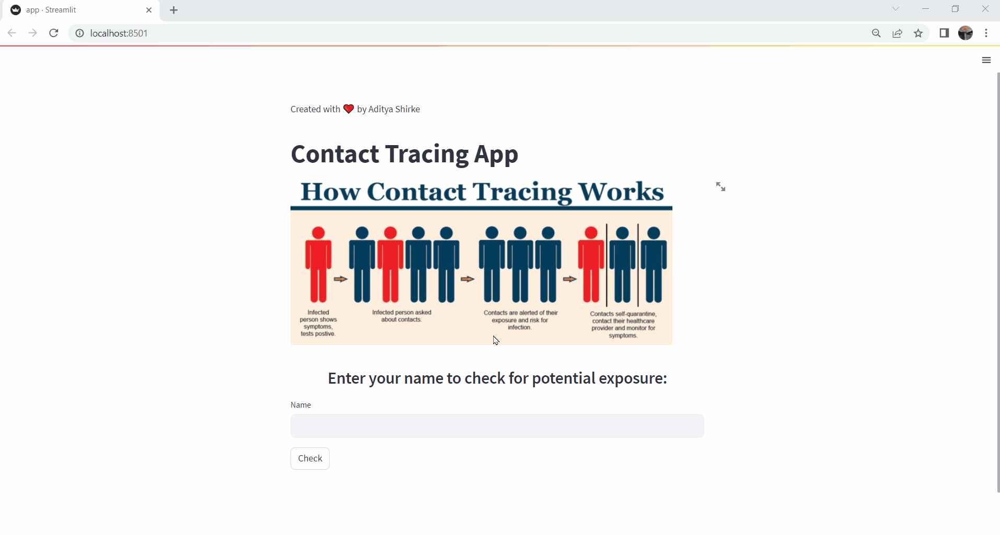

# COVID-19 Contact Tracing App

A Contact Tracing App implemented in Python using Streamlit to help track potential exposure to COVID-19. The app takes user input and checks for potential contacts with infected individuals based on location data.



## Features

- User-friendly interface for entering the name and checking for potential exposure.
- Utilizes DBSCAN clustering algorithm to identify potential contacts.
- Displays a list of infected people if potential exposure is detected.
- Provides appropriate messages based on the outcome of the check.

## Technologies Used

- Python
- Streamlit
- Pandas
- scikit-learn

## How to Use

1. Clone the repository:

   ```shell
   git clone https://github.com/your-username/contact-tracing-app.git

2. Install the required dependencies:

   pip install -r requirements.txt

3. Prepare the contact tracing data:

   Create a JSON file named contacttracing_data.json with the required data structure.
   Make sure to include columns for id, latitude, and longitude.

4. Run the app:

   streamlit run app.py
   
5. Enter your name in the app to check for potential exposure.

## Demo

Here's a GIF demonstrating the working of the Contact Tracing App:


## Contributors

- Aditya Shirke - [GitHub](https://github.com/AdityaShirke8005) - [LinkedIn](https://www.linkedin.com/in/aditya-shirke-031695269/)


